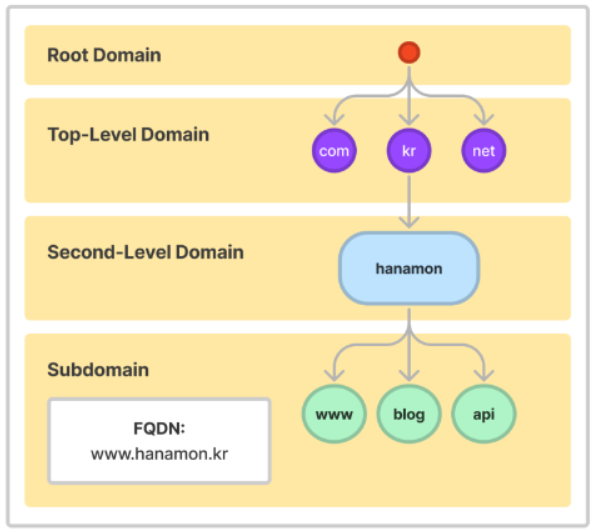
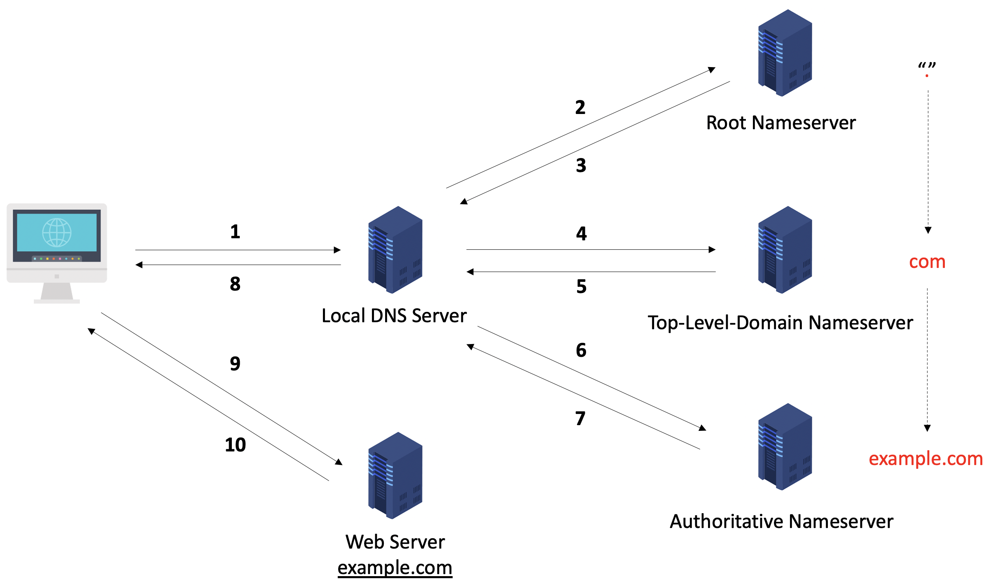

## DNS

> IP주소를 브라우저에게 제공하면 해당 서버에서 웹 페이지를 제공하는 식
> 복잡한 IP주소를 외우고 있기 힘들므로 `도메인`을 사용

 

### **Domain Name System**

- 사람이 이해하기 쉬운 `도메인` 이름을 실제 네트워크상에서 사용하는 `IP 주소로` `변환`하는 역할을 수행하는 `분산형` `데이터베이스` 시스템

- ex ) www.naver.com => 223.130.195.200

- 도메인 수가 너무 많기 때문에 DNS 서버 종류를 계층화해서 단계적으로 처리

 

### 종류

**Local DNS ( 기지국 DNS 서버 )**

- 인터넷을 사용하기 위해 IP를 할당해주는 통신사 ( KT, SK , LG 등.. ) 에 등록

- Local DNS 란 각 통신사의 DNS서버

**Root DNS ( 루트 네임 서버 )**

- 인터넷 도메인 네임 시스템의 루트존

- 국제인터넷주소관리기구 ( ICANN ) 이 직접 관리하는 서버

- TLD DNS 서버 IP들을 저장해두고 안내하는 역할

**TLD DNS Server (Top-Level Domain, 최상위 도메인 )**

- 도메인 등록 기관이 관리하는 서버로 도메인 이름의 가장 마지막 부분을 의미

- Authoritative DNS 서버 주소를 저장해두고 안내하는 역할

- Ex) .com / co.kr 등

**Authoritative DNS Server**

- 실제 개인 도메인과 IP주소의 관계가 기록/저장/변경되는 서버

- 찾고 있는 마지막 주소가 저장

 

### 동작과정

1. 웹 브라우저는 Local DNS 서버에 해당 도메인의 IP주소를 요청

2. 접속정보가 캐싱되어 있으면 바로 IP주소를 알려줌

3. 접속정보가 없을 경우 Root DNS 서버에 요청 + com 주소 알려줌

4. Local DNS 서버는 com 도메인을 관리하는 TLD DNS 서버에 요청 + naver.com 주소 알려줌

5. Local DNS 서버는 naver.com 도메인을 관리하는 Authoritative DNS 서버에 요청

6. Local DNS 서버는 해당 도메인의 IP주소를 응답 및 캐싱

7. 웹 브라우저에게 응답받은 IP주소 전달

 

이런 방식을 **Recursive Query** 라고 함
