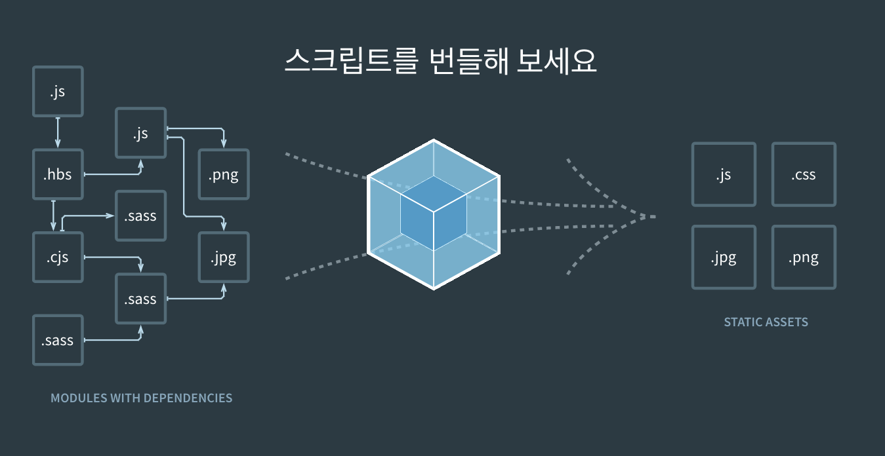
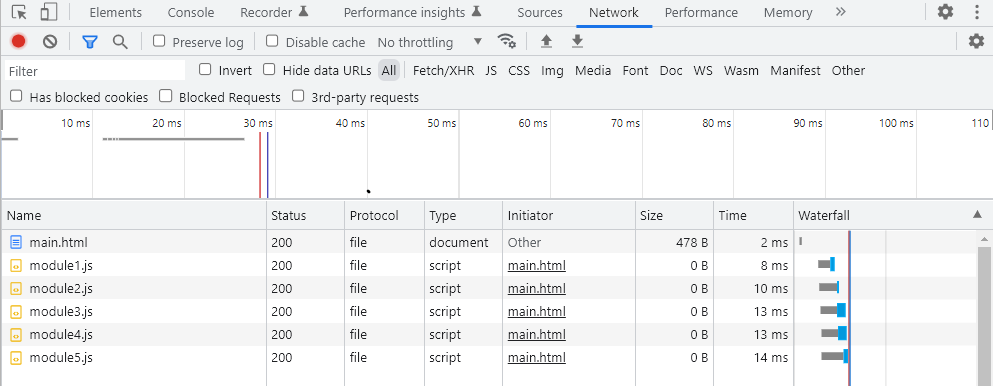

# Webpack

### 1. 정의

<aside>
💡 모듈 번들러

</aside>

-   웹 어플리케이션을 구성하는 자원(컴포넌트, 이미지, CSS 파일 등)을 **모듈 단위로 나누어** 필요할 때마다 조합하여 하나의 결과물로 산출시키는 역할을 한다.



### 2. 사용 이유

1. **파일 단위의 자바스크립트 모듈 관리의 필요성**

    - 자바스크립트는 **전역 변수**라는 개념을 가지고 있다.
    - 따라서, 전역 변수의 문제점인 변수의 중복 문제가 발생할 수 있다.

    ```html
    <!-- index.html -->
    <html>
        <head>
            <!-- ... -->
        </head>
        <body>
            <!-- 여기서 각각의 변수가 충돌날 가능성이 있음 -->
            **
            <script src="./app.js"></script>
            <script src="./main.js"></script>
            **
        </body>
    </html>
    ```

    - 이를 해결하기 위해 자바스크립트 파일을 모듈로 관리하게 되었고, **CommonJS, AMD, ESModule** 등의 모듈 시스템이 만들어졌다.

        - **CommonJS, AMD, ESModule**

            - CommonJS

                ```jsx
                // myModule.js
                const myModule = {
                    x: 1,
                    y: function () {
                        console.log("Hello!");
                    },
                };
                module.exports = myModule;

                // anotherFile.js
                const myModule = require("./myModule");
                console.log(myModule.x); // 1
                myModule.y(); // 'Hello!'
                ```

            - AMD

                ```jsx
                // Define a module 'myModule'
                define("myModule", [], function () {
                    return {
                        hello: function () {
                            console.log("Hello!");
                        },
                    };
                });

                // Use the module in another file or section of your application
                require(["myModule"], function (myModule) {
                    myModule.hello(); // 'Hello!'
                });
                ```

            - ESModule(ESM)

                ```jsx
                // myModule.js
                const x = 1;
                const y = () => console.log("Hello!");
                export { x, y };

                // anotherFile.js
                import { x, y } from "./myModule";
                console.log(x); // 1
                y(); // 'Hello!'
                ```

    - 웹팩은 다양한 모듈화 방식 중 **ESModule** 방식을 사용한다.

1. **웹 어플리케이션의 빠른 로딩 속도와 높은 성능**



-   웹페이지에 접속하게 되면 js, image, font 등 많은 리소스 파일들이 다운받아지는데, 만약 사용하는 파일들이 **수천개로 늘어난다면 로딩 시간이 길어질 것이다.**
-   이를 해결하기 위해 웹팩은 **여러 파일을 하나로 병합 및 압축하는 기능을 제공**하고 있다.

---

## Babel

### 1. 정의

<aside>
💡 입력과 출력이 모두 자바스크립트인 자바스크립트 컴파일러

**[공식문서]**
현재 및 이전 브라우저 또는 환경에서 ECMAScript 2015+(ES6 이상) 코드를 이전 버전의 JavaScript로 변환하는 데 주로 사용되는 툴체인

</aside>

-   자바스크립트에 컴파일러가 필요한 이유?
    -   모든 브라우저가 최신 문법이나 기술**(ES6)**을 지원하지 않기 때문에 구 기능**(ES5)**으로 변환하는 작업이 필요하다.

[What is Babel? · Babel](https://babeljs.io/docs/)

```jsx
// Babel Input: ES6 arrow function
[1, 2, 3].map((n) => n + 1);

// Babel Output: ES5 equivalent
[1, 2, 3].map(function (n) {
    return n + 1;
});
```

### 2. 사용 이유

-   **크로스 브라우징을 위해 사용**
    -   **크로스 브라우징?**
        -   **최대한 많은 종류의 웹 브라우저에서 정상적으로 작동**하는 웹페이지를 만드는 방법론 중 하나
        -   어느 브라우저나 기기에서든 사이트가 의도된 대로 보여지고 작동하는 기법
    -   우리가 운영하는 웹사이트가 모든 브라우저에서 같은 동작을 하길 바랄 것이다.
    -   하지만, 모든 브라우저 마다 지원되는 언어와 문법이 다르기 때문에 하나의 코드로는 모든 브라우저에 대응하는 것이 힘들다.
    -   브라우저 별로 다른 코드들을 작성하는 것보다는 **내가 작성하는 코드가 범용성 높게 최대한 많은 브라우저에서 동작하게 된다**면, 이러한 크로스 브라우징을 할 수 있을 것이다.
        **⇒ 이때 사용되는 것이 babel이다.**
    -   **즉, 작성된 코드와 다양한 브라우저 간의 호환성(크로스 브라우징)을 위해 babel을 사용한다.**

### 3. 예시

-   **ES6 문법**을 사용하는 파일

```jsx
const arrowFunc = () => {}; // 화살표 함수
const spreadOperator = [...[1, 2, 3], ...[4, 5, 6]]; // spread 연산자
const aPromise = new Promise();
const aSet = new Set(1, 2, 3);
const includesMethod = [1, 2, 3].includes("1");
```

-   위 코드가 컴파일 되면 아래와 같다. (**ES5 이하**로 변환)
    -   ES5 이하를 지원하는 브라우저에서도 쓰일 수 있도록 babel로 컴파일을 진행해야 한다.

```jsx
var arrowFunc = function arrowFunc() {}; // 함수 선언문
var spreadOperator = [1, 2, 3].concat([4, 5, 6]); // concat함수

// 변경되지 않음
var aPromise = new Promise();
var aSet = new Set(1, 2, 3);
var includesMethod = [1, 2, 3].includes("1");
```

-   어떤 문법은 정상적으로 바벨에 의해 컴파일 되었지만, 어떤 문법은 컴파일되지 못했다.
-   `화살표 함수` → `함수 선언문`으로 변경되었고, `spread 연산자`는 `concat 함수`로 변경되었다.
-   반면 **Promise, Set, includes**는 변경되지 않았다. ⇒ **`폴리필 필요`**
    -   해당 기능을 지원하지 않는 환경에서는 동일한 동작을 보장하기 위해 폴리필이 필요하다.
    -   예를 들어, 현재 실행시킨 브라우저에서 ES6 문법인 Promise를 지원하지 않는다면, 해당 코드는 에러를 발생시킬 것인데 이때 폴리필을 사용해준다면 **오래된 환경에서도 Promise와 같은 최신 기술을 사용**할 수 있게 해준다**.**

---

## Polyfill

### 1. 정의

polyfill은 이전 브라우저에서 기본적으로 지원하지 않는 **최신 기능을 제공하는 데 필요한 코드**이다.

### 2. 사용 이유

-   특정 브라우저의 기능 제약을 극복하고, 모든 사용자에게 일관된 웹 어플리케이션 경험을 제공할 수 있다.

### 3. 폴리필 예시

1. **Array.from() : 유사 배열 객체나 이터러블 객체를 배열로 변환하는 메서드**

-   다음은 Array.from() 메서드를 구현한 폴리필이다.

```jsx
if (!Array.from) {
    Array.from = function (arrayLike) {
        return Array.prototype.slice.call(arrayLike);
    };
}
```

⇒ 만약 브라우저가 Array.from()을 지원하지 않는 경우, 위의 코드를 사용하여 해당 기능을 구현할 수 있다.

1. **fetch() : 네트워크 요청을 보내고 응답을 받아오는 메서드**

```jsx
if (!window.fetch) {
    window.fetch = function (url, options) {
        return new Promise(function (resolve, reject) {
            var xhr = new XMLHttpRequest();
            xhr.open(options ? options.method : "GET", url);
            xhr.onload = function () {
                if (xhr.status >= 200 && xhr.status < 300) {
                    resolve(xhr.response);
                } else {
                    reject(new Error(xhr.statusText));
                }
            };
            xhr.onerror = function () {
                reject(new Error("Network Error"));
            };
            xhr.send(options ? options.body : null);
        });
    };
}
```

-   이러한 코드들은 직접 구현하거나, 라이브러리를 통해 다운받을 수 있다.

### 4. 사용 예시

```jsx
if (window.NodeList && !NodeList.prototype.forEach) { //브라우저에 forEach문이 정의되지 않았다면
    NodeList.prototype.forEach = function (callback, thisArg) {
        thisArg = thisArg || window;
        for (var i = 0; i < this.length; i++) {
            callback.call(thisArg, this[i], i, this);
        }
    };
} // 폴리필 삽입

 const a = document.querySelectorAll('.help');
 a.forEach(function(ele){
 ele.classList.add('hello')
```

-   폴리필이 필요한 메서드 이전에 삽입해야 한다.

---

### 참조

https://happysisyphe.tistory.com/49

[https://velog.io/@boyeon_jeong/폴리필이란](https://velog.io/@boyeon_jeong/%ED%8F%B4%EB%A6%AC%ED%95%84%EC%9D%B4%EB%9E%80)
