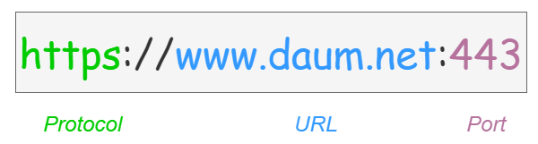
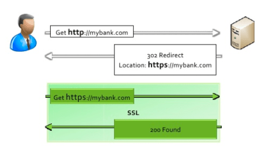
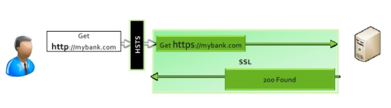
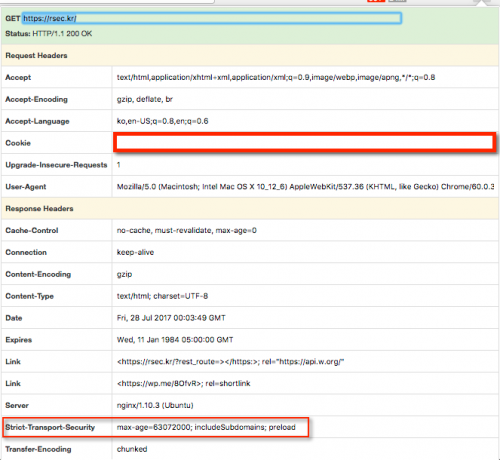
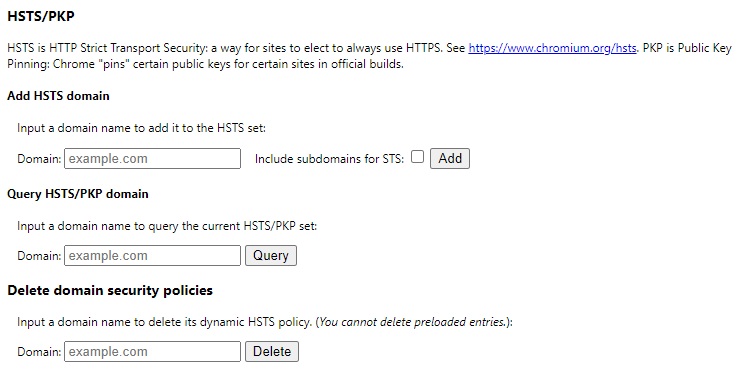
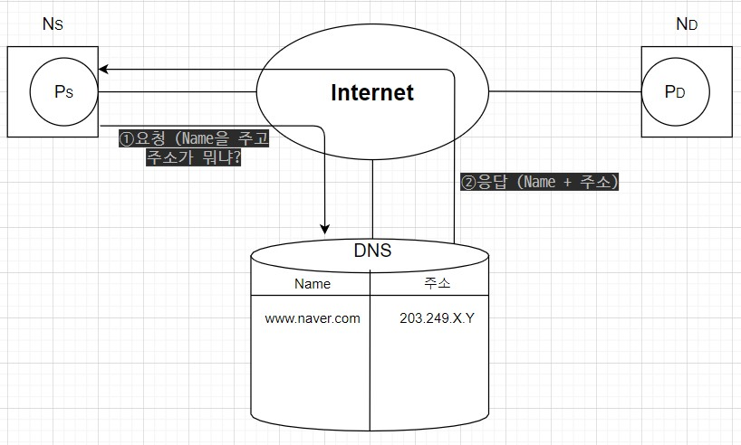
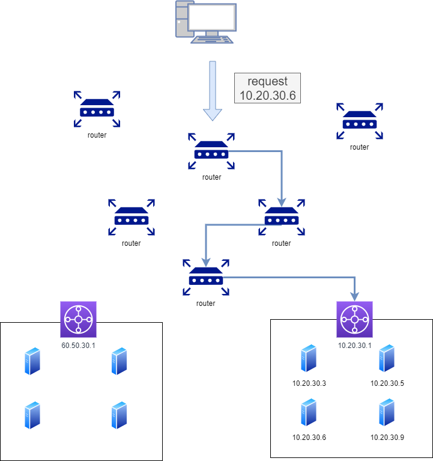
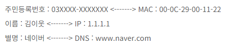
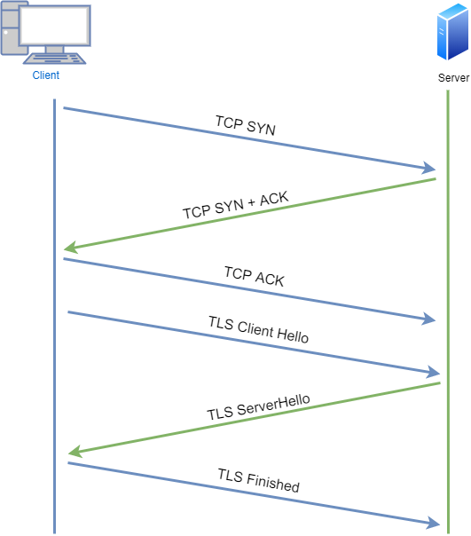
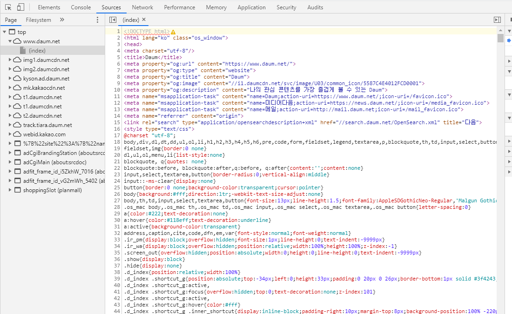

# 브라우저 주소창에 www.google.com을 입력하면 발생하는 일을 설명해주세요.

## 1. 브라우저의 URL 파싱

URL을 입력받은 브라우저는 이 URL의 구조를 해석한다.

`어떤 프로토콜`, `어떤 도메인(URL)`, `어떤 포트`로 보낼지를 해석한다.

-   만약 프로토콜과 포트를 입력한 적이 없다면?
    -   브라우저에 설정된 기본값을 통해 요청한다.
    -   HTTP라면 80번 포트 / HTTPS라면 443번 포트를 기본값으로 요청한다.

 

## 2. HSTS 목록 조회

-   HSTS는 **HTTP를 허용하지 않고 HTTPS를 사용하는 연결만 허용하는 기능**이다.
-   HSTS를 적용한 경우, 만약 HTTP로 요청이 오면 HTTP 응답 헤더에 **`Strict Transport Security`**라는 필드를 포함하여 응답하고, 이를 확인한 브라우저는 해당 서버에 요청할 때 **HTTPS만을 이용해 통신하게 된다**.
-   HSTS 캐시에 해당 URL을 저장하는데, 이를 HSTS 목록이라고 한다.
-   이러한 HSTS 목록을 조회한 후, 해당 URL의 요청을 HTTPS로 보낼지 판단한다.
    -   해당 URL이 HSTS에 존재하는 경우 ⇒ 명시적으로 HTTP를 요청한다고 해도 브라우저가 이를 HTTPS로 변경하여 요청
    -   HSTS에 존재하지 않는 경우 ⇒ 그냥 HTTP로 요청

### HSTS란?

-   일반적으로 **HTTPS로 접속을 유도**하는 방법

1. mybank.com을 주소창에 타이핑하고 엔터를 입력한다.
2. 브라우저는 앞에 프로토콜이 없음을 인식하고 http를 붙인다. 그리고 http.mybank.com으로 요청을 보낸다.
3. 웹 서버는 이러한 http url에 대해 301이나 302 응답(리다이렉트 상태코드)을 통해 https로 요청을 다시 보낼 것을 요청한다.
4. 브라우저는 https:mybank.com으로 요청을 보내고, 안전한 통신을 시작한다.

> 이때, 1,2,3번의 절차는 필요없는 과정이기 때문에 **불필요한 네트워크 요청을 제거하기 위해 사용하는 것**이 **HSTS**이다.

-   **HSTS를 적용**한 브라우저와 웹 서버를 사용하는 경우

1. 처음 웹 서버에 접속할 때, 응답 헤더로 **Strict-transport-security**라는 내용이 함께 온다.
2. HSTS를 지원하는 브라우저는 헤더의 내용을 확인하고 HSTS 목록에 URL을 저장한다. (max-age 동안)

**HSTS 등록 방법**

-   `chrome://net-internals/#hsts`
    -   이걸 주소창에 입력하면 HSTS를 등록할 수 있다.

 

## 3. URL을 IP주소로 변환

-   url은 컴퓨터끼리 통신하기에 적합하지 않기 때문에 이를 컴퓨터가 읽을 수 있는 IP로 변환해야 한다.
-   도메인 이름을 IP 주소로 변환하는 과정은 크게 2가지로 이루어진다. 1. 자신의 [\*\*localhost](http://localhost) 파일**과 **웹 캐시**에 해당 URL이 존재하는지 확인하고 있다면 그것을 불러온다. \* 해당 웹 캐시에는 url과 ip포트 정보가 저장되어 있다. 2. 존재하지 않으면, 도메인 주소를 IP 주소로 변환해주는 **DNS 서버\*_에 요청하여 해당 URL을 IP 주소로 변환한다.
    _ DNS 서버 : 53번 포트
    

 

## 4. 라우터를 통해 해당 서버의 게이트웨이까지 이동

-   여기까지 온거면 DNS 서버에서 IP 주소를 받은 상태이니, 이제 해당 서버에 요청을 보내면 된다.
-   하지만 IP 주소만 알고 있을 뿐, 어떻게 가야할지 모르는 상태이다.

-   이때, 라우터의 라우팅 테이블을 통해 요청이 어떤 경로를 가야하는지 알 수 있고, 이를 통해 해당 IP 주소를 찾아갈 수 있다.
-   이 그림에서 IP 주소는 10.20.30.6 이고, 이 IP 주소에 도착하기까지의 경로를 찾아가는 과정을 나타낸다.

 

## 5. ARP를 통해 IP 주소를 MAC으로 변환

-   **현재 도착지의 IP주소에 도착했으면, 이를 물리적 주소인 MAC으로 변환해야 한다.**
    -   변환하는 이유 : IP는 **도착지를 찾기위한 라우팅에 사용**되었다면, 이를 **실질적 통신을 위해** MAC 주소로 변환해야 한다.
-   APR(Address Resolution Protocol)를 통해 IP ⇒ MAC 주소로 변환한다.
-   **IP 주소와 MAC 주소의 차이**
    -   **IP**
        -   **`192.168.1.1`**
        -   논리 주소
        -   라우팅을 하기 위해 사용
        -   고정된 주소가 아닌 인터넷 망에 접속할 때마다 달라지는 주소
    -   **MAC**
        -   **`00:FF:FF:AB:BB:AA`**
        -   물리 주소
        -   실제 통신을 하기 위해 사용
        -   device 마다 할당된 물리적 주소
-   쉽게 설명하면 사람의 주민등록번호를 MAC 주소, 이름은 IP 주소라고 생각하면 된다.
-   사람을 지목할 때, 이름을 부르지 주민등록번호를 부르지 않기 때문

 

## 6. 대상 서버와 TCP 소켓 연결

-   여기까지 왔으면 실제 **MAC 주소**를 가지고 있다.
-   처음에 `naver.com`을 입력했다면 ⇒ DNS를 통해 IP 주소를 알고 ⇒ ARP를 통해 MAC 주소로 변환하여 실제 물리 주소를 알게 되었다.
-   이제는 연결을 진행해야 한다. ⇒ TCP의 `3-way-handshake`를 통해 진행 +`https 요청`일 경우 3-way-handshake 이후 `TLS-handshake`가 추가로 필요하다. (암호화 통신을 위해)

 

## 7. HTTP(S) 프로토콜로 요청, 응답

-   이제 연결이 확정되었다. ⇒ 서버에 HTTP 프로토콜로 요청

1. 이제는 `**www.naver.com`의 내용을 달라고 서버에 요청\*\*해야 한다.
2. 서버에서는 이 요청을 받고, 수락할 수 있는지 검사한다.
3. 그리고 나서 이 요청에 대한 **응답을 생성하여 브라우저에 전달**한다.

 

## 8. 브라우저에서 응답을 해석

-   서버에서 응답한 내용들은 Html, CSS, JS로 이루어져있다.

-   이를 브라우저에서 해석하여 렌더링하고, 우리는 그 해석한 결과물을 보게된다.

 

---

### 참조

[https://github.com/dongkyun-dev/TIL/blob/master/web/👍www.naver.com을 검색하면 어떤 과정을 거쳐서 우리의 화면에 그려지는가.md](https://github.com/dongkyun-dev/TIL/blob/master/web/%F0%9F%91%8Dwww.naver.com%EC%9D%84%20%EA%B2%80%EC%83%89%ED%95%98%EB%A9%B4%20%EC%96%B4%EB%96%A4%20%EA%B3%BC%EC%A0%95%EC%9D%84%20%EA%B1%B0%EC%B3%90%EC%84%9C%20%EC%9A%B0%EB%A6%AC%EC%9D%98%20%ED%99%94%EB%A9%B4%EC%97%90%20%EA%B7%B8%EB%A0%A4%EC%A7%80%EB%8A%94%EA%B0%80.md)

https://deveric.tistory.com/97
[https://velog.io/@tnehd1998/주소창에-www.google.com을-입력했을-때-일어나는-과정](https://velog.io/@tnehd1998/%EC%A3%BC%EC%86%8C%EC%B0%BD%EC%97%90-www.google.com%EC%9D%84-%EC%9E%85%EB%A0%A5%ED%96%88%EC%9D%84-%EB%95%8C-%EC%9D%BC%EC%96%B4%EB%82%98%EB%8A%94-%EA%B3%BC%EC%A0%95)

https://jin-network.tistory.com/46
