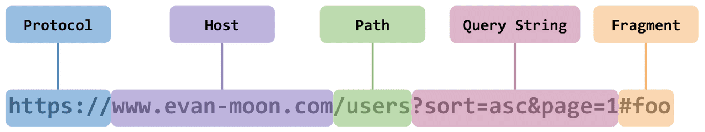
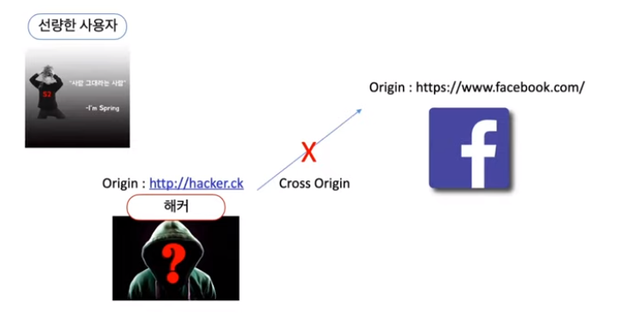
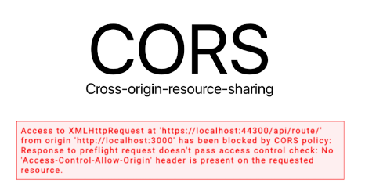
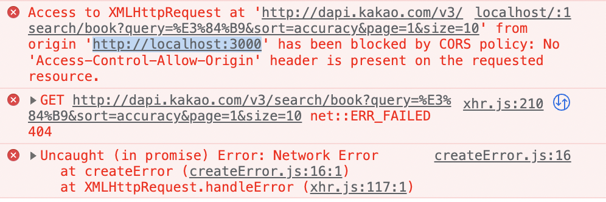
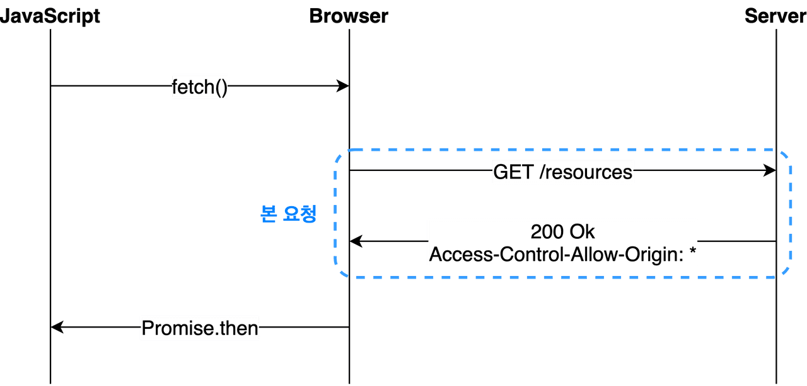
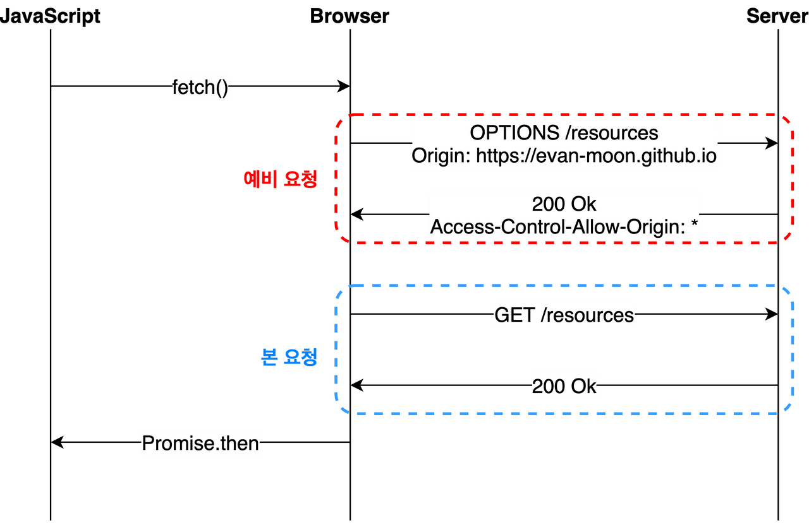
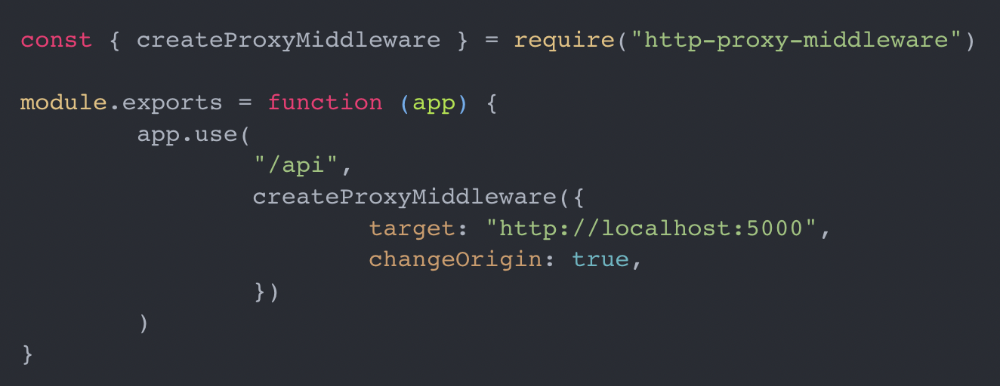

# CORS가 무엇이며, 해결하기 위한 방법에 대해 설명해주세요.

## 1. SOP (same origin policy)

<aside>
💡 다른 출처의 리소스를 사용하는 것에 제한하는 보안 방식  
다르게 말하면, 같은 출처 안에서만 리소스를 공유할 수 있다는 규칙을 가진 정책

</aside>

### **출처**란?



여기서 **출처(Origin)**는 Protocol, Host, 포트번호를 의미한다.

### 같은 출처의 의미

-   프로토콜, 호스트, 포트가 같으면 같은 출처라고 한다.

### 같은 출처(Same Origin) / 다른 출처(Cross Origin)

Q. `http://localhost`와 동일 출처인 url은 무엇일까요?

1. https://localhost
2. http://localhost:80
3. http://127.0.0.1
4. http://localhost/api/cors

-   정답
    (2), (4)
    (2)번 - http 기본 포트가 `80포트`이다.
    (4)번 - /api 앞에 `:80`가 숨겨져 있다.
    틀린 이유
    (1)번은 프로토콜이 다르기 때문에 다른 출처이다.
    (3)번은 브라우저는 string으로 값을 비교하기 때문에 127.0.0.1이 localhost의 ip라고 해도 string값이 같아야 같은 출처로 인정된다.

### SOP를 왜 사용해야 할까?



-   만약 해커 측에서 facebook에 악의적인 요청을 보낸다면 심각한 일이 발생한다.
-   이를 방지하기 위해 동일 출처 내에서만 리소스를 공유하는 SOP가 존재하는 것이다.

---

하지만,,, 웹상에서는 리소스를 공유하는 것이 흔하고, 특히 다른 출처인 경우가 많다.

우리가 API 통신 할때만 해도 프론트-백 서버 띄워놓고 수많은 리소스를 공유해야한다.

이렇게 **다른 출처의 리소스가 필요하다면** 어떻게 해야할까 ?

---

## 2. CORS란

<aside>
💡 Cross-Origin Resource Sharing의 줄임말로, 한국어로는 **교차 출처 리소스 공유**라고 한다. (교차 출처: 다른 출처)
풀어서 설명하자면 한 출처에서 실행 중인 웹 애플리케이션이 다른 출처의 자원에 접근할 수 있는 권한을 부여하도록 하는 체제이다.

</aside>





---

## 3. CORS 동작방식

-   기본적으로 웹에서 다른 출처로 리소스를 요청할 때는 HTTP 프로토콜을 사용하여 요청을 보내게 된다. 이때, origin 필드에 요청을 보내는 출처를 담아서 보낸다.
    `Origin: http://www.naver.com`
-   이후 서버가 이 요청에 대한 응답을 할 때, 응답헤더 `**Access-Controll-Allow-Origin**`이라는 값에 이 리소스에 접근하는 것이 허용된 출처를 같이 보내준다.
-   응답을 받은 브라우저는 자신이 보낸 Origin과 서버에서 받은 `**Access-Controll-Allow-Origin`\*\* 을 비교한 후, 이 응답이 유효한지 판단한다.
-   기본적인 흐름은 이렇지만 CORS가 동작하는 방식은 한 가지가 아니라 세가지 시나리오에 따라 변경된다. ⇒ 따라서 어떤 시나리오에 해당하는지 잘 파악한다면 CORS 에러에 대응하는 것이 수월해진다.

**CORS의 3가지 시나리오**

1. 단순요청 (Simple Request)

2. 프리플라이트 요청 (Preflight Request)

3. 인증정보 포함 요청 (Credentialed Request)

### 1) 단순 요청

-   preflight와 로직은 같지만 예비 요청이 없다.
-   하지만, 특정 조건을 만족해야 단순 요청이 가능하다.
-   단순 요청이 가능한 경우
    1. 요청 메서드는 get, head, post 중 하나
    2. Accept, Accept-Language, Content-Language, Content-Type, DPR, Downlink, Save-Data, Viewport-Width, Width를 제외한 헤더를 사용하면 안된다.
    3. content-type을 사용하는 경우, application/x-www-form-urlencoded, multipart/form-data, text/plain만 허용된다.



### 2) 프리플라이트 요청

브라우저는 요청을 한 번에 보내지 않고, **예비 요청**과 **본 요청**으로 나누어서 서버로 전송한다.

이때 보내는 예비 요청이 preflight이다.

preflight 정보

-   본 요청을 보내기 전에 브라우저가 이 요청을 보내는 것이 안전한지 확인하는 용도
-   HTTP 메서드 중 OPTIONS 메서드가 사용된다.



-   여기서 CORS 여부를 판단하는 것은 예비 요청의 응답을 받은 이후이다.

### 3) 인증정보 포함 요청

-   인증된 요청을 사용하는 방법이다.
-   이 방식은 다른 출처간의 통신에서 보안을 좀 더 강화하고 싶을 때 사용된다.
-   기존 브라우저가 제공하는 비동기 리소스 요청 API인 XMLRequset나 fetch API는 별도의 요청 없이 브라우저의 쿠키 정보나 인증과 관련된 헤더를 함부로 요청에 담지 않는다.
-   이 때 요청에 인증과 관련된 정보를 담을 수 있게 해주는 옵션이 바로 credentials 옵션 이다.

3가지의 옵션

| same-origin (기본값) | 같은 출처 간 요청에만 인증 정보를 담을 수 있다 |
| -------------------- | ---------------------------------------------- |
| include              | 모든 요청에 인증 정보를 담을 수 있다           |
| omit                 | 모든 요청에 인증 정보를 담지 않는다            |

---

## 4. CORS 에러 해결 방법

### 정석적인 방법 - 서버에서 해결

서버에서 `Access-Control-Allow-Origin` 헤더에 유효한 값을 포함하여 응답을 브라우저로 보내면 해결할 수 있다.

-   프론트에서 CORS 에러를 발견했다면 서버에게 Access-Control-Allow-Origin에 유효한 값을 포함해서 달라고 요청해야 한다.

### 프론트에서 해결

보통은 API를 만든 백엔드 개발자에게 부탁하겠지만, 백엔드 개발자와의 소통이 불가능한 상황이라면 ?

예를 들어 오픈 API를 사용하거나, 프론트 혼자 개발한다거나..

1. 프록시 서버

-   프론트에서 CORS 정책을 우회하는 가장 흔한 경우이다.
-   이렇게 하면 /api로 시작하는 URL로 보내는 요청에 대해 우회하기 때문에 ‘/api/user’는 ‘/user’로 변환된다.

```jsx
module.exports = {
  devServer: {
    proxy: {
      '/api': {
        target: 'https://api.evan.com', // api로 시작하는 url은 모두 target으로 리다이렉션 된다.
        changeOrigin: true,
        **pathRewrite: { '^/api': '' },**
      },
    }
  }
}
```

2. 내가 직접 서버 구축하기

3. 로컬 한정 http-proxy-middleware 라이브러리 사용하기

http-proxy-middleware를 설치하고

setupProxy.js 라는 파일을 src 폴더 내에 만들고 아래 코드를 작성해준다.



---

### 참고

테코톡(나봄의 CORS) : [https://www.youtube.com/watch?v=-2TgkKYmJt4&ab_channel=우아한테크](https://www.youtube.com/watch?v=-2TgkKYmJt4&ab_channel=%EC%9A%B0%EC%95%84%ED%95%9C%ED%85%8C%ED%81%AC)

[https://velog.io/@jh100m1/CORS-에가-뭔데-어떻게-해결하는건데](https://velog.io/@jh100m1/CORS-%EC%97%90%EA%B0%80-%EB%AD%94%EB%8D%B0-%EC%96%B4%EB%96%BB%EA%B2%8C-%ED%95%B4%EA%B2%B0%ED%95%98%EB%8A%94%EA%B1%B4%EB%8D%B0)

https://evan-moon.github.io/2020/05/21/about-cors/
