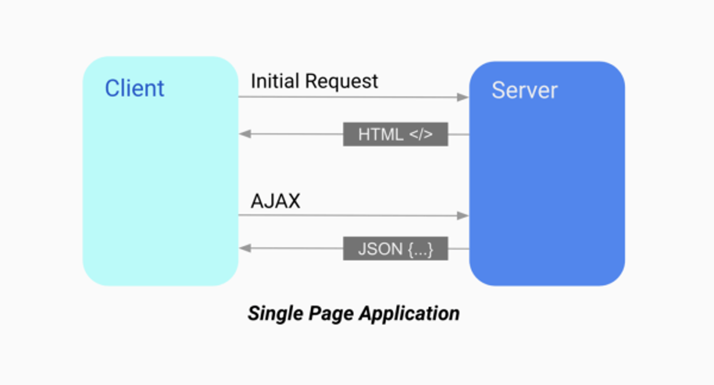
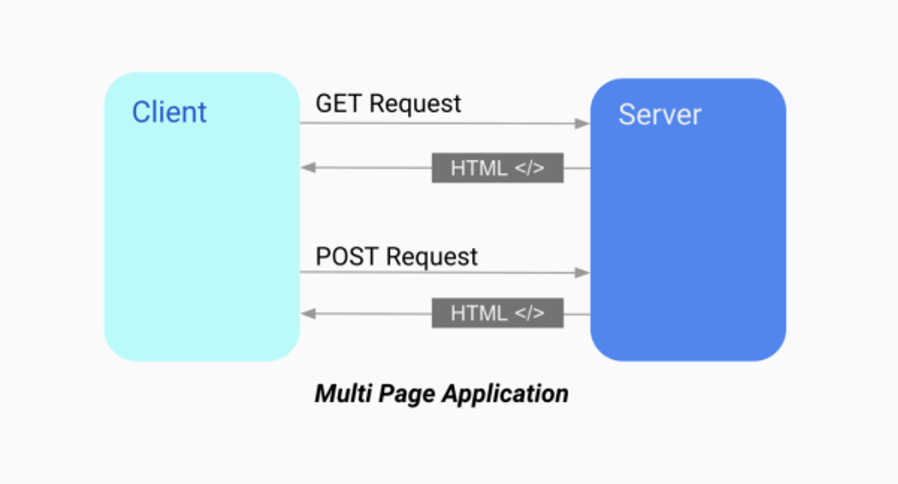

#SPA, CSR, SSR의 차이를 설명해 주세요.

# SPA vs MPA

## SPA : Single Page Application

- 하나(Single)의 Page로 구성된 Application
- `SPA`는 `Client Side Rendering(이하 CSR)` 방식으로 렌더링한다.
- 단 한 번만 리소스(HTML, CSS, JavaScript)를 로딩한다.
- 그 후에는 데이터를 받아올 때만 서버와 통신한다.
    - 즉, 첫 요청시 딱 한 페이지만 불러오고 페이지 이동 시 기존 페이지의 내부를 수정해서 보여주는 방식

클라이언트 관점에서 말하자면 최초 페이지를 로딩한 시점부터는 페이지 리로딩 없이 필요한 부분만 서버로 부터 받아서 화면을 갱신하는 것이다.

<aside> 💡 필요한 부분만 갱신하기 때문에 네이티브 앱에 가까운 자연스러운 페이지 이동과 사용자 경험(UX)을 제공할 수 있다.

</aside>

**Angular, React, Vue** 등 프론트엔드 기술들이 나오면서 크게 유행하고 있다.



그런데 CSR 방식으로 만든 SPA 앱은 `Search Engine Optimization (이하 SEO)`가 어렵다.

일반적인 SPA 앱을 검색로봇 입장에서 보면 모든 페이지의 소스가 아래와 같이 보이다.

```html
<html>
<head>
  <title>Single Page Application</title>
  <link rel="stylesheet" href="app.css" type="text/css">
</head>
<body>
  <div id="app"></div>
  <script src="app.js"></script>
</body>
</html>
```

검색엔진이 `색인`을 할 만한 컨텐츠가 존재하지 않는 것이다.


### 👍🏻 SPA 장점

- 자연스러운 사용자 경험 (UX)
    - 전체 페이지를 업데이트 할 필요가 없기 때문에 빠르고 ‘깜빡거림’이 없다.
- 필요한 리소스만 부분적으로 로딩 (성능)
    - SPA의 Application은 서버에게 정적리소스를 한 번만 요청하고 받은 데이터는 전부 저장해놓는다. `(캐시=Cache)`
    - 서버의 템플릿 연산을 클라이언트로 분산 `(성능)`
    - 컴포넌트별 개발 용이 `(생산성)`
    - 모바일 앱 개발을 염두에 둔다면 동일한 API를 사용하도록 설계 가능 `(생산성)`

### 👎🏻 SPA 단점

- JavaScript 파일을 번들링해서 한 번에 받기 때문에 초기 구동 속도가 느리다
    - Webpack의 code splitting으로 해결 가능
- 검색엔진최적화(SEO)가 어려움
    - SSR로 해결 가능
- 보안 이슈
    - 프론트엔드에 비즈니스 로직 최소화
- SSR에서는 사용자에 대한 정보를 서버측에서 세션으로 관리를 하지만 CSR 방식에서는 클라이언트측의 쿠키말고는 사용자에 대한 정보를 저장할 공간이 마땅치 않다.

<aside> 💡 주의 SPA 방식이 모두 CSR인 것은 아니다.

</aside>


## MPA : Multiple Page Application

- `MPA`는 `Server Side Rendering(이하 SSR)` 방식으로 렌더링한다.
- 새로운 페이지를 요청할 때마다 서버에서 렌더링된 정적 리소스(HTML, CSS, JavaScript)가 다운로드된다.
- 페이지 이동하거나 새로고침하면 전체 페이지를 다시 렌더링한다.





### 👍🏻 MPA 장점

- SEO 관점에서 유리하다.
    - MPA는 완성된 형태의 HTML 파일을 서버로부터 전달받는다.
    - 따라서 검색엔진이 페이지를 **크롤링하기에 적합**하다.
- 첫 로딩 매우 짧다.
    - 서버에서 이미 렌더링해 가져오기 때문이다.
    - 그러나 클라이언트가 JS 파일을 모두 다운로드하고 적용하기전 까지는 각각의 기능은 동작하지않는다.

### 👎🏻 MPA 단점

- 새로운 페이지를 이동하면 ‘깜빡’인다. `(UX)`
    - 매 페이지 요청마다 리로딩(새로고침) 발생
    - 새로운 페이지를 요청할 때마다 전체 페이지를 다시 렌더링하기 때문이다.
- 페이지 이동시 불필요한 템플릿도 중복해서 로딩 `(성능)`
- 서버 렌더링에 따른 부하모바일 앱 개발시 추가적인 백엔드 작업 필요 `(생산성)`
    - 개발이 복잡해질 수 있다.


---

# SSR vs CSR

#### 가장 큰 차이점 세 가지

- 초기 렌더링 속도
- SEO
- 보안


## SSR: Server Side Rendering

웹에 시작부터 `MPA`가 있었다. 사실 MPA라는 용어도 SPA와 비교를 위해 등장한 인상이 강하다. 웹의 초기부터 SPA에 대한 구현체들이 나오기 전까지는 전통적인 웹사이트들은 모두 MPA 형태로 서비스해 왔다.

MPA는 페이지를 이동할 때마다 새로운 페이지를 요청한다. 모든 템플릿은 서버 연산을 통해서 렌더링하고 완성된 페이지 형태로 응답한다. 이 과정을 `서버 사이드 렌더링(SSR)`이라고 부른다.

서버 사이드 렌더링의 장점은 `SEO`이다. 전통적인 MPA의 경우 브라우저에서 JavaScript 코드가 동작하기 전에도 완성된 형태의 템플릿 (HTML에 데이터가 삽입된 상태)을 서버로 부터 전달받는다. 이 때문에 검색로봇이 페이지를 크롤링하기에 매우 적합하다.

- 리액트 → Next.js
- Vue → Nuxt.js


#### 작동 순서


### 👍🏻 장점

- 초기 렌더링 속도가 빠르다.
    - 사용자는 브라우저가 자바스크립트 파일을 해석하고 보여질때까지 기다리지 않고 바로 렌더링을 하기 때문
- 검색엔진최적화가 가능하다. (SEO)

### 👎🏻 단점

연속적으로 렌더링을 할 경우 서버 부하가 비교적 많다.

페이지 이동할때마다 하얀색 화면이 보인다. (사용자 경험 저하)


## CSR: Client Side Rendering

최초에 한번 서버에서 전체 페이지를 로딩하여 보여주고 이후에는 사용자의 요청이 올 때마다, 리소스를 서버에서 제공한 후 클라이언트가 해석하고 렌더링하는 방식이다.

#### 작동 순서


1. 비어있는 html의 태그를 먼저 가져오게 된다.
2. 클라이언트가 자바스크립트 파일을 브라우저에서 해석한 HTML을 랜더링 해준다.
3. 즉 브라우저가 자바스크립트를 fetch 한 이후 UI가 보여지게 된다. 그렇기 때문에 초기 렌더링이 오래 걸린다.

### 👍🏻 장점

- 여러개의 페이지로 존재하고 보이더라도, 내부적으로는 1개의 HTML 파일이다.
- 클라이언트가 서버는 Ajax 와 같은 요청을 서버에 보내고 서버는 JSON 형태의 데이터를 내려준다.
- 자바스크립트 쪽에 변화가 생길 때마다 reactDOM 에서 직접 그 바뀐 부분만 변환을 시켜준다.
    - (전체를 리렌더링 해주는 SSR과는 다른점)
    - 즉, 클라이언트에서 응답 데이터를 기반으로 새로운 페이지가 아닌 그 부분에 대해서만 업데이트한다.
- 사용자에게 부드러운 경험 (UX) 를 줄 수 있다.
- 필요한 데이터만 그때그때 요청하기 때문에 서버 트래픽이 현저히 감소한다.

### 👎🏻 단점

- 검색엔진최적화가 불가능하다.
- 초기 렌더링이 느리다.


---

# SEO: Search Engine Optimization

- 검색 엔진 최적화

`CSR`의 경우 SEO를 사용할 수 없는 문제들을 아래와 같은 방법으로 개선할 수 있다.

- 웹페이지 header에 **메타데이터**를 정확하게 써 놓기
- 로그인과 admin 페이지는 CRA로 작업(eject 스크립트를 사용하면 CSR, SSR 혼합 사용 가능)
- 다른 페이지의 노출을 위해 `Next.js`를 사용
- HTML의 `시맨틱 구조`를 잘 활용하여 구글이 크롤링할 때 더 쉽게 정보를 입력할 수 있도록 개선
