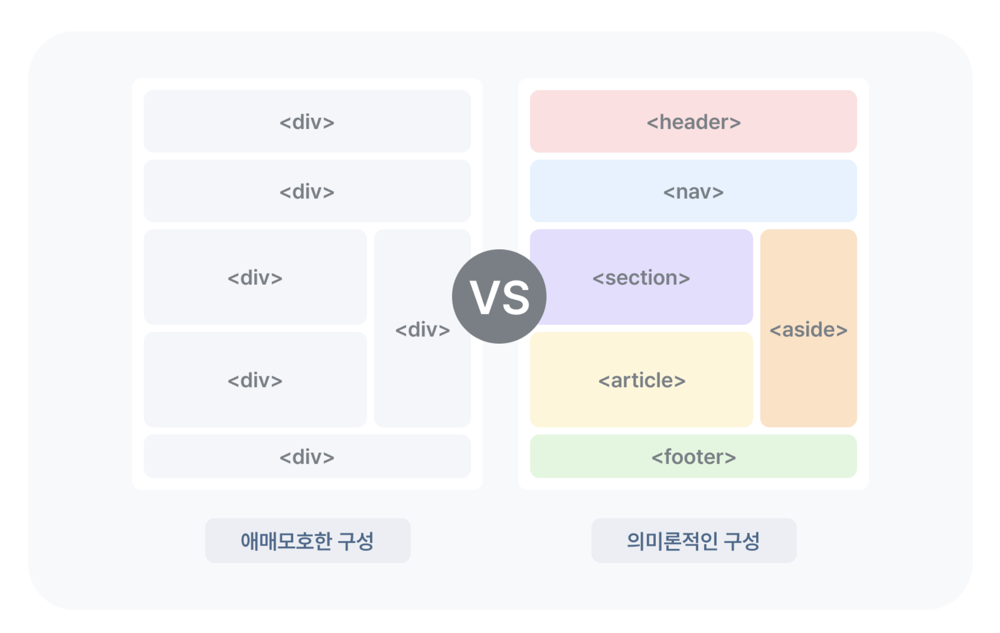
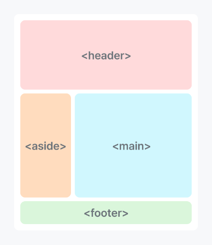

# Semantic Markup에 대해 설명해 주세요


## 시맨틱 마크업(Semantic Markup)이란?

- `Semantic` - 의미론적인
- `Markup` - HTML 태그로 문서를 작성하는 것

즉 시맨틱 마크업은 작업에 있어서 태그들이 의미를 잘 전달 할 수 있도록 문서를 작성하는 것을 말한다.




#### ✅ 시맨틱 태그를 이용하지 않은 경우

```html
<div id="container" class="wrapper">

	<div id="header">
		<div id="title">페이지의 제목</div>
		<div id="nav">
			페이지의 내비게이션 영역
			<div class="gnb">메뉴</div>
		</div>
	</div>
    
	<div id="contents">
		<div class="main_cont">
			메인 컨텐츠 영역
			<div class="txt_box">내용</div>
		</div>
		<div class="side_cont">사이드 내용</div>
	</div>

	<div id="footer">
		하단바닥글
		<address>주소 & 연락처</address>
	</div>
    
</div>
```

#### ✅ 시맨틱 태그를 이용한 경우

```html
<div id="container" class="wrapper">

	<header>
		<h1>페이지의 제목, 로고</h1>
		<nav>
			페이지의 내비게이션 영역.
		</nav>
	</header>
	
 	 <main>
		<section>일반적인 문서 영역. (제목태그와 함께 작성 권장.)
        	<article>독립된 컨텐츠. (게시판, 블로그, 뉴스, 매거진...)</article>
		</section>
		<aside>간접 컨텐츠. 보조 컨텐츠.</aside>
	</main>

	<footer>
		하단 바닥글. 회사정보, 저작권, 연락처...
	</footer>
    
</div>
```

이렇게 시멘틱 마크업을 하는 이유는 다양한 이유가 있겠지만 특히 **`검색 엔진 최적화`, `웹접근성`, `가독성`**에 장점이 있기 때문이다.


#### 자주 사용되는 Semantic 태그

html5에 시맨틱 웹을 위해 관련 태그들이 제공된다.

|시맨틱 웹을 위한 태그|설명|
|---|---|
|header|말그대로 문서의 헤더영역을 의미합니다.  페이지의 머리글, 제목, 로고, 메뉴, 검색 관련, 유틸, 작성자의 이름 등등으로 구성합니다.|
|nav|페이지의 내비게이션 영역. (사이트 내, 외부로 이동). 메뉴, 목차, 색인 등등|
|main|메인 컨텐츠 영역. 문서 내에서 _반드시_ 한 번만 사용합니다.  다른 header, footer, nav, article, section, aside의 하위로 작성할 수 없습니다.|
|section|본문의 여러 내용(article)을 포함하는 부분을 의미합니다.|
|article|본문의 주 내용이 들어가는 부분을 의미합니다.|
|aside|간접 컨텐츠, 보조 컨텐츠를 의미하며, 대체적으로 옆에 위치하는 내용의 부분을 의미합니다.|
|footer|하단 바닥글을 의미합니다. 주로 들어가는 정보는 회사정보, 저작권, 연락처 등등이 있습니다.|



## 시맨틱 마크업을 해야하는 이유

#### 📌 1. 검색 엔진 최적화(SEO)

검색 엔진은 시맨틱 태그를 주요 키워드로 간주하기 때문에 검색 엔진 최적화에 유리하다. 단순히 `<div>`와 `<span>`만 사용한 문서는 어떤 부분이 중요한 영역인지 구분이 어렵다.

#### 📌 2. 웹 접근성

- 웹 접근성이란?
    
    웹 접근성은, 장애인,고령자 등이 웹 사이트에서 제공하는 정보에 비장애인과 동등하게 접근하고 이해할 수 있도록 보장하는 것을 말한다.
    
    예로는 시각장애인들을 위해 웹 페이지의 내용을 음성으로 알려주는 스크린 리더, 마우스를 사용할 수 없는 사용자를 위하여 키보드만으로도 모든 콘텐츠에 접근할 수 있게하는 서비스 등이 있다.
    

웹 접근성을 위한 서비스들은 HTML 태그를 기반으로 작동하기 때문에 시맨틱 마크업을 통해 웹 접근성이 뛰어난 웹앱을 구현할 필요가 있다.

#### 📌 3. 가독성

다른 개발자와의 협업에 있어서도 시맨틱 마크업은 의미가 있다. • 단순한 `div` , `span` 으로 둘러싸인 요소들보다 코드를 볼 때 가독성이 더 좋다.


## 읽어보면 좋을 것 같아요

- [https://brunch.co.kr/@tigrisdesign/7](https://brunch.co.kr/@tigrisdesign/7)