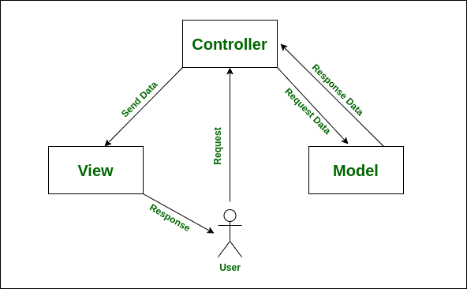

# MVC, MVVM 패턴에 대해 설명해주세요.

## MVC

<aside>
💡 model, view, controller의 역할을 나눈 패턴
소프트웨어의 비즈니스 로직과 화면을 구분하는데 중점을 두고 있다.

</aside>

-   **Model** : 데이터를 다루는 부분
-   **View** : 레이아웃과 화면을 다루는 부분
-   **Controller** : 사용자의 명령을 받아 Model과 View 부분을 이어주는 부분

### 동작 방식

1. 사용자가 브라우저에서 웹 페이지 주소를 입력해 서버로 HTTP GET 요청을 보낸다.
2. 서버는 `Controller`에서 HTTP GET 요청을 받는다.
3. `Model`에서 비즈니스 로직을 처리한다.
4. `Model`은 `Controller`로 화면에 필요한 데이터를 넘겨준다.
5. `Controller`는 받아온 데이터를 `View`에 넘겨주어 HTML 파일을 만든다.
6. `Controller`에서 만들어진 HTML파일을 브라우저에게 넘겨준다.
7. 브라우저는 HTML 파일을 렌더링한다.

### 장점

1. 각자의 역할만 수행하면 되기 때문에 시스템 결합도를 낮출 수 있다.
2. 유지보수 시 특정 컴포넌트만 수정하면 되기 때문에 쉽게 시스템 변경이 가능하다.

---

## MVVM

<aside>
💡 model, view, view model의 역할을 나눈 패턴
`비즈니스 로직`과 `프레젠테이션 로직`을 `UI로부터 분리`하는 것이 목표이다.

</aside>

-   **Model** : 비즈니스 로직과 데이터를 처리하는 부분
-   **View** : UI에 관련된 것을 다룸 (구조, 레이아웃, 형태 등)
-   **View Model** : View를 표현하기 위해 만든 **View를 위한 Model,** View는 View Model의 상태 변화를 observe하기 때문에 \*\*\*\*data의 갱신을 View가 자동으로 받아올 수 있게 되어있다.

### 장점

1. View와 Model 사이의 의존성이 없다.
2. Model과 View 사이의 어댑터로서 View Model이 변경되었을 때 변경을 최소화할 수 있다.

### 단점

1. View Model의 설계가 쉽지 않다.
2. 복잡해질수록 Controller 처럼 ViewModel이 비대해진다.
3. 표준화된 틀이 존재하지 않아 사람마다 이해가 다르다.

---

**참조**

[https://velog.io/@eunhye_k/MVC-패턴의-이해](https://velog.io/@eunhye_k/MVC-%ED%8C%A8%ED%84%B4%EC%9D%98-%EC%9D%B4%ED%95%B4)

https://medium.com/@jjangAA/mvvm-pattern-91ec4410ac03
