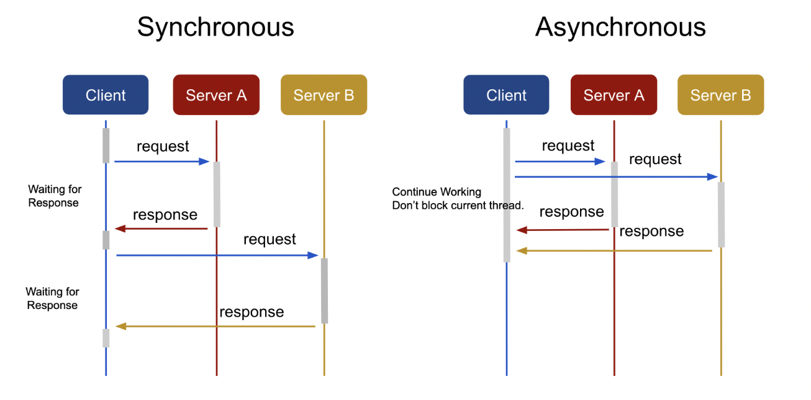

# Sync와 Async의 차이점을 설명해주세요.

> 동기와 비동기를 나누는 가장 큰 차이점 : **이전 작업의 종료 여부를 고려하는가?**

## Sync - 동기식

먼저 시작된 작업이 끝날 때까지 **기다렸다가 새로운 작업을 실행**한다.

작업의 실행 순서가 확실히 정해져 있고, 반드시 그 순서 그대로 실행된다.

-   장점
    -   설계가 간단하고 직관적이다.
-   단점
    -   요청에 대한 결과가 반환되기 전까지 대기해야한다.

## Async - 비동기식

**먼저 시작된 작업을 기다려주지 않고(종료 여부와 관계 없이)** 새로운 작업을 실행한다.

요청과 결과가 동시에 일어나지 않는 방식이다.

-   장점
    -   요청에 대한 결과가 반환되기 이전에 다른 작업을 병렬적으로 수행할 수 있다.
-   단점
    -   동기방식보다 설계가 복잡하다.

### Javascript의 비동기 처리 방식

> 자바스크립트는 **기본적으로 동기적으로 동작**한다.
> 그러나 개발하다 보면 비동기 안에서도 **동기적으로 동작해야하는 경우가 발생**하는데,
> 이러한 **비동기식 동작 안에서 동기적으로 동작하도록 해주는 것을 비동기 처리**라고 한다.

1. **`Callback 함수`** ⇒ 함수에 함수를 넘겨서 동기적으로 발생하는 것 처럼 처리
2. **`Promise`** ⇒ js에서 비동기 처리에 사용되는 객체
3. **`async / await`** ⇒ callback hell을 해결하기 위한 문법

3가지 방법으로 비동기 처리를 진행한다.

---

### 참조

https://tlsdnjs12.tistory.com/12

https://hazel-developer.tistory.com/179
