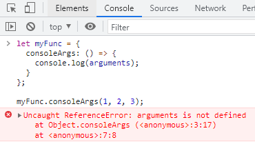
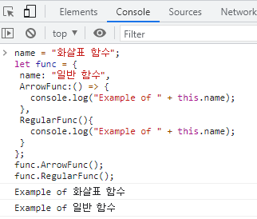
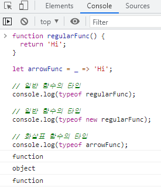

# 일반함수와 화살표함수의 차이

## 화살표 함수란

<aside>
💡 ES6에 도입된 새로운 기능으로 일반 함수를 보다 간결하게 작성할 수 있다.

</aside>

## 1. 구문

일반 함수

```jsx
function addFunc(x, y) {
    return x + y;
}
```

화살표 함수

```jsx
let addFunc = (x, y) => {
    return x + y;
};

// 본문이 짧은 경우 중괄호 생략 가능
let addFunc = (x, y) => x + y;

// 인수가 하나만 있는 경우 소괄호 생략 가능
let twiceFunc = (x) => x * 2;
```

## 2. Arguments 바인딩

<aside>
💡 `arguments 객체`는 일반함수에서만 사용가능하다.

</aside>

일반 함수에서는 인자로 1, 2, 3을 넘겨주니 arguments 객체에 값이 들어간 것을 볼 수 있다.


화살표 함수에서는 arguments 객체에 접근할 수 없다.



> arguments 객체란

-   함수 내부에서 사용할 수 있는 지역변수
-   arguments 객체를 사용하여 **함수 내에서 함수의 인자를 참조**할 수 있다.

## 3. this 키워드 사용

<aside>
💡 this는 일반함수에서만 사용가능하다.

</aside>

예시

-   ArrowFunc는 화살표 함수, RegularFunc는 일반 함수로 정의되어 있다.

```jsx
name = "화살표 함수";

let func = {
    name: "일반 함수",
    ArrowFunc: () => {
        console.log("Example of " + this.name);
    },
    RegularFunc() {
        console.log("Example of " + this.name);
    },
};

func.ArrowFunc();
func.RegularFunc();
```

-   실행 결과
    -   화살표 함수안에 사용된 this는 **화살표 함수가 정의된 외부의 this 값을 가리킨다.**
        

## 4. new 키워드 사용

<aside>
💡 new 키워드는 일반함수만 사용할 수 있다.

</aside>

> new는 **새로운 빈 객체를 생성하는 키워드**이다.

예시

-   regularFunc는 일반함수, arrowFunc는 화살표함수이다.

```jsx
function regularFunc() {
    return "Hi";
}

let arrowFunc = (_) => "Hi";

console.log(typeof regularFunc); // 일반 함수의 타입
console.log(typeof new regularFunc()); // 일반 함수의 타입

console.log(typeof arrowFunc); // 화살표 함수의 타입
console.log(typeof new arrowFunc()); // 에러 발생
```

실행 결과



화살표 함수는 new 키워드를 사용하여 생성자 함수로 사용할 수 없다.


### 정리

-   일반함수와 화살표함수의 차이는 일반 함수는 arguments, this, new 키워드를 사용 가능하지만, 화살표 함수는 사용할 수 없다.

### 참조

https://developer-talk.tistory.com/284
