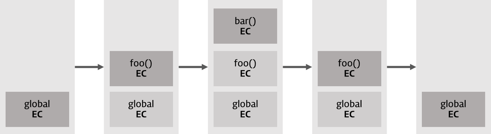
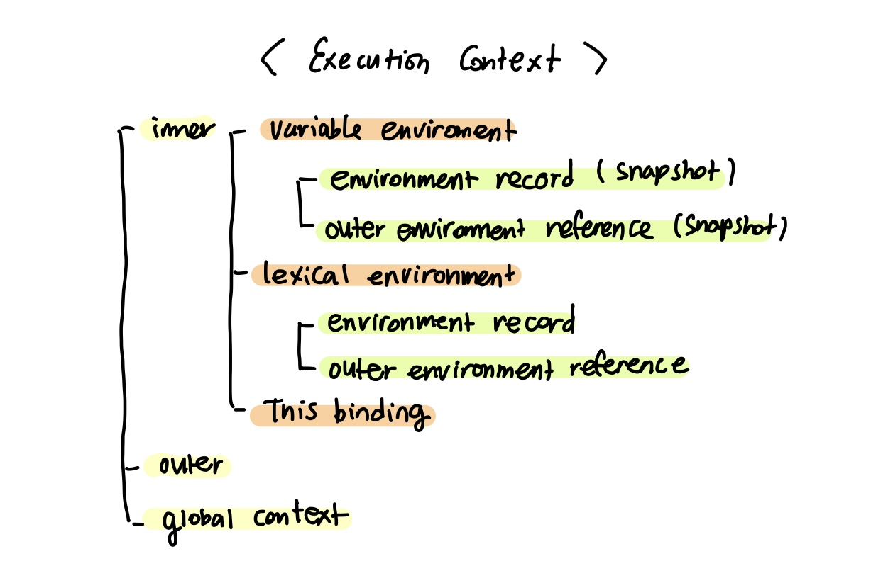

# Execution Context

## 실행 컨텍스트란

실행 컨텍스트는 `scope`, `hoisting`, `this`, `function`, `closure` 등의 동작원리를 담고 있는 **자바스크립트의 핵심원리** 이다.

즉, 실행할 코드에 제공할 환경 정보들을 모아놓은 객체임

<br/>

### 실행 컨텍스트의 동작 방식

실행 컨텍스트는 동일한 환경에 있는 **코드들을 실행할 때 필요한 환경 정보** 들을 모아 객체를 구성하고, 이를 **콜 스택**에 쌓아올렸다가, 가장 위에 쌓여있는 컨텍스트와 관련있는 코드들을 실행하는 식으로 **전체 코드의 환경과 순서를 보장**한다.

→ 🙎🏻‍♀️ 지금 보면 뭔소린가 싶은데 본문을 다 본 후에 다시 읽어보면 이해될거임

<aside>
💡 실행 컨텍스트가 활성화되는 시점에 선언된 변수를 위로 끌어올리고 외부 환경 정보를 구성하고, this 값을 설정하는 등의 동작을 수행한다.

</aside>

### 동작 예시

```jsx
var x = 'xxx';

function foo () {
  var y = 'yyy';

  function bar () {
    var z = 'zzz';
    console.log(x + y + z);
  }
  bar();
}
foo();
```

1. 처음 자바스크립트 코드를 실행하는 순간 `global context`가 콜 스택에 담긴다.
    1. `global context` 는 코드 내부에서 별도의 실행 명령이 없어도 브라우저에서 자동으로 실행하므로 자바스크립트 파일이 열리는 순간 `global context` 가 활성화됨
    2. 참고로 브라우저의 경우에는 `window` 객체가 전역 실행 컨텍스트가 된다.
    3. 콜스택에서 `global context` 와 관련된 코드들을 차례대로 진행한다.
2. foo 함수를 호출하면 자바스크립트 엔진은 foo에 대한 환경 정보를 수집해서 foo `실행 컨텍스트`를 생성한 후 콜 스택에 담는다.
    1. 콜 스택의 맨 위에 foo 실행 컨텍스트가 놓였으므로 `global context`와 관련된 코드의 실행을 중지한다.
    2. `foo` 실행 컨텍스트와 관련된 코드, 즉 `foo` 함수 내부의 코드들을 순차로 실행한다.
3. `bar` 함수의 실행 컨텍스트가 스택의 가장 위에 담긴다.
    1. foo 실행 컨텍스트와 관련된 코드의 실행을 중단한다.
    2. `bar` 함수 내부의 코드를 순서대로 진행한다.
4. 코드가 모두 진행되고 `bar` 함수의 실행이 종료되면 `foo` 실행 컨텍스트가 콜 스택의 맨 위에 존재하게 되므로 중단했던 부분부터 이어서 실행하게 된다.



<br/>

## 실행 컨텍스트 유형

### ****A. Global Execution Context****

기본 실행 컨텍스트로 함수 내부에 없는 코드는 전역 컨텍스트에서 실행된다고 생각하면 된다. 이 전역 컨텍스트 안에서는 두 가지 작업을 수행한다.

- 첫 번째, `window` 전역 컨텍스트를 생성한다.
- 두 번째, `this` 를 전역 객체(Global Object)로 설정한다.

### ****B. Functional Execution Context****

함수가 호출 될 때마다 해당 함수에 대한 새로운 실행 컨텍스트가 생성된다. 각 함수별로 실행 컨텍스트를 가지고 있지만 실행 컨텍스트는 함수가 호출될 때 만들어진다. 함수 실행 컨텍스트(Functional Execution Context)는 얼마든지 있을 수 있으며 새로운 실행 컨텍스트가 생성될 때마다 차례대로 수행된다.

### ****C. Eval Function Execution Context****

eval 함수 내에서 실행되는 코드도 실행 컨텍스트를 가지지만 보안상의 문제로 eval은 잘 사용되지 않는다.

<br/>

## 실행 컨텍스트 구조



### 실행 컨텍스트에 들어있는 것들

- **Variable Environment**
    
    현재 컨텍스트 내의 식별자들에 대한 정보 + 외부 환경 정보
    
    - environmentRecord (`snapshot`)
    - outerEnvironmentReference (`snapshot`)
- **Lexical Environment**
    
    처음에는 `VariableEnvironment`와 같지만 변경 사항이 실시간으로 반영된다.
    
    - environmentRecord
    - outerEnvironmentReference
- **this binding**
    
    this 식별자가 바라봐야 할 대상 객체를 의미
    

- 호이스팅의 탄생 배경
    
    자바스크립트 엔진이 실행 컨텍스트를 구성할 때 **environmentRecord 에 식별자의 정보를 수집**합니다. 이러한 과정을 통해 엔진은 함수를 실행하기도 전에 해당 컨텍스트 내부의 변수명들을 **이미 알고있습니다**.
    이렇기에 식별자들을 코드의 최상단으로 끌어올렸다! 라는 호이스팅이라는 개념이 생겨납니다. 물리적으로 끌어올린 것이 아닌, 실행 컨텍스트 관점에선 이미 식별자들의 정보를 알고 있으니 식별자 정보를 수집하는 과정을 이해하기 쉬운 방법으로 나타낸 추상화한 **가상 개념**입니다.
    
    LexicalEnvironment 의 environmentRecord 의 경우 **해당 컨텍스트 환경에 필요한 식별자와 식별자의 값이 기록**되며, 함수 실행 시 실행 컨텍스트가 생성되므로 (함수 실행보다 environmentRecord 수집이 먼저 되므로) 변수와 같은 식별자를 끌어올리는 것과 같다 라는 개념의 호이스팅이 생겨났습니다.
    

## 참고: 읽어보면 좋은 글

- https://gamguma.dev/post/2022/04/js_execution_context
    - 실행 컨텍스트부터 호이스팅까지 js 동작원리를 큰 흐름에서 이해하기 좋은 글
- https://catsbi.oopy.io/fffa6930-ca30-4f7e-88b6-28011fde5867