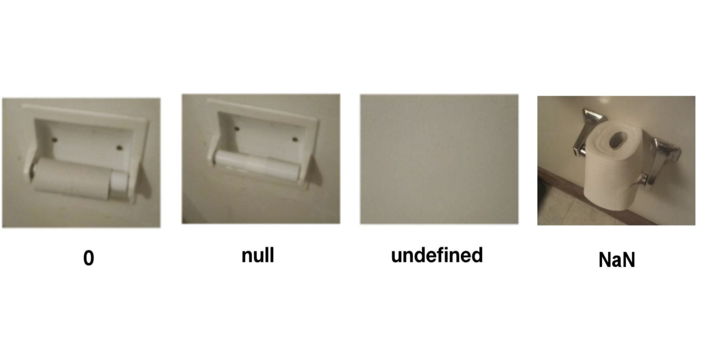

## 배경: 자바스크립트의 요상한 falsy 값

#### 💡 자바스크립트에서의 `null`, `NaN`, `undefined`

위 값들은 다른 프로그래밍 언어에는 없는 자바스크립트에만 있는 요상한 falsy 값으로서, 이들은 모두 값이 없음(falsy)을 나타내는 특별한 값이다. 그래서 이들은 조건문에서 `false`로 평가되어 진다.

<br/>

### 차이점 한눈에 확인하기



<br/>

## 0의 상태

정수 0은 대다수 프로그래밍 언어에서 `false`로 평가된다.

## null의 상태

- null은 의도적으로 변수에 null을 할당하여 값이 없다는 것을 나타낸다.
- Null이 할당된 변수의 타입을 확인해 보면 `object`인 것을 알 수 있다.
- 한마디로 타입은 객체이고 비어있는 변수이다.

```jsx
let a = null;
console.log(a); // null
console.log(typeof a); //object
```

## undefined의 상태

- `undefined`는 변수가 정의되어 있지 않은 상태, 즉 값이 할당되지 않은 상태를 나타낸다.
- 타입이 결정되지 않은 변수이다.

```jsx
let b;
console.log(b); // undefined
console.log(typeof b); // undefined
```

위의 결과를 보면 타입이 정의되지 않았음을 알 수 있다.

### undefined == null, undefined === null

```jsx
console.log(undefined == null); //true
console.log(undefined === null); //false
```

비교연산자(==)는 자료형이 다르면 자료형을 강제로 맞춰서 비교하는 연산자이다.

Undefined와 null은 자료형이 다르니 강제로 맞춰서 값을 비교하면 둘 다 값이 없으니 true가 된다.

하지만 ===연산자를 이용하면 자료형까지 비교하므로 false가 된다. null은 의도적으로 빈 값이 들어간 object이기 때문이다.

## undeclared의 상태

- 접근 가능한 스코프에 변수 선언조차 되어있지 않은 상태이다.
- 타입을 확인해 보면 `undefined`이다.

```jsx
console.log(b); // ReferenceError: b is not defined
console.log(typeof b); // undefined
```

그런데 실제로 typeof는 undeclared인 경우에도 undefined를 뱉어 오류 처리를 내뱉지 않는다.

## NaN의 상태

- `NaN`는 `Not a Number`의 약어이다.
- 표현을 못하는 수치형 결과를 나타내며, 이 속성은 값이 유효한 숫자가 아니라는 것을 말한다.
- 즉, 컴퓨터로는 표현할 수 없는 숫자값이다.

```jsx
let a = NaN;
console.log(a); // NaN
console.log(typeof a); // number
```

- isNaN() 함수로 NaN 검출하기
    
    window 객체에 존재하는 isNaN을 사용할 경우 형변환 까지 친절하게 해주어 예상하지 않은 동작이 이루어질 수 있다.
    
    그러나 Number.isNaN을 쓰게 되면 숫자형 타입일때만 검사를 할 수 있다.
    
    ```jsx
    const test = "test"
    
    console.log(typeof test) // string
    console.log(isNaN(test)) // true
    console.log(Number.isNaN(test)) // false
    ```
<br/>

# 결론

- `null`: 명시적으로 값이 없음을 나타냄
- `undefined`: 값이 할당되지 않음
- `undeclared`: 변수가 선언되지 않음
- `NaN`: 숫자가 아닌 값