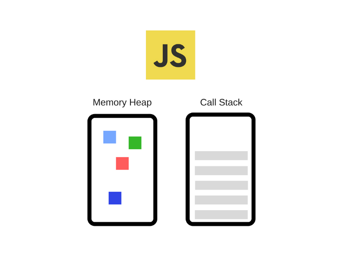
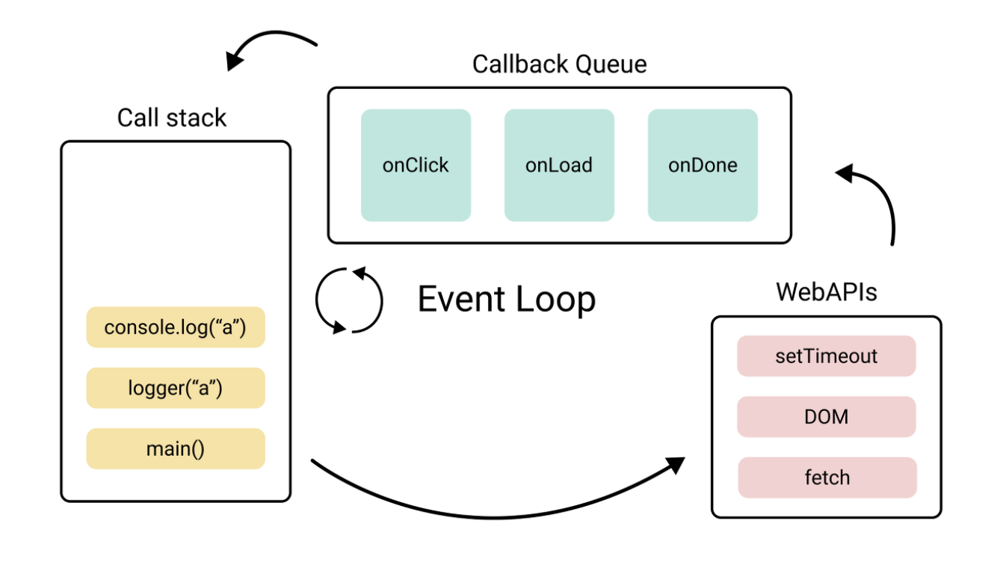

# 자바스크립트 동작 원리

## 자바스크립트는 싱글 스레드이다.

`싱글 스레드` 언어가 가지는 의미는 아래와 같다.

- 한 번에 한 가지 일밖에 처리할 수 없다.
- **Call Stack**이 하나이다.

 

## 자바스크립트 엔진 JS Engine

자바스크립트 엔진은 Javascript 코드를 이해하고 실행을 도와준다.

대표적인 JS Engine으로 **V8**엔진이 있다. (Chrome, Node.js에서 사용)

JS Engine은 Memory Heap과 Call Stack으로 구성되어 있다.

### Memory Heap

- 데이터를 임시 저장하는 곳
- 함수나 변수, 함수를 실행할 때 사용되는 값들을 저장한다.

### Call Stack

- 코드가 실행되면 코드 내부의 실행 순서를 기록해 놓는 곳
- 코드를 하나씩 순차적으로 진행할 수 있도록 도와주는 곳

 

## 싱글 스레드 언어가 어떻게 작업(task)들을 동시에 처리할까

자바스크립트는 싱글 스레드 언어이지만 작업들을 동시에 처리하는 것처럼 보인다. 이는 `Event Loop` 가 비동기 작업을 처리해 주기 때문이다.

- **Call Stack** : 자바스크립트 엔진이 코드 실행을 위해 사용하는 메모리 구조
- **Web APIs** : 브라우저에서 제공하는 API 모음으로, 비동기적으로 실행되는 작업들을 전담하여 처리한다. (AJAX 호출, 타이머 함수, DOM 조작 등)
- **Callback Queue** : 비동기적 작업이 완료되면 실행되는 함수들이 대기하는 공간
- **Event Loop :** 비동기 함수들을 적절한 시점에 실행시키는 관리자

 

### Event Loop의 동작 과정

이벤트 루프는 브라우저 내부의 Call Stack, Callback Queue, Web APIs 등의 요소들을 모니터링하면서 비동기적으로 실행되는 작업들을 관리한다.

1. 비동기 자바스크립트 코드를 만나면 Web APIs에게 맡긴다.
2. 백그라운드 작업이 끝난 결과를 콜백 함수 형태로 큐(Callback Queue)에 넣는다.
3. 처리 준비가 되면 Call Stack에 넣어 마무리 작업을 진행한다.

<aside>
💡 `Web APIs` 들은 **멀티스레드**이다.
자바스크립트를 실행하는 **Call Stack**은 싱글 스레드지만, 서버에게 리소스를 요청하거나 파일 입출력 혹은 타이머 대기 작업을 실행하는 **Web APIs**들은 **멀티 스레드**이기 때문에 동시 작업 처리가 가능한 것이다.

</aside>

## 참조

[https://inpa.tistory.com/entry/🌐-js-async](https://inpa.tistory.com/entry/%F0%9F%8C%90-js-async)

[https://blog.toycrane.xyz/진짜-쉽게-알아보는-자바스크립트-동작-원리-c7fbdc44cc97](https://blog.toycrane.xyz/%EC%A7%84%EC%A7%9C-%EC%89%BD%EA%B2%8C-%EC%95%8C%EC%95%84%EB%B3%B4%EB%8A%94-%EC%9E%90%EB%B0%94%EC%8A%A4%ED%81%AC%EB%A6%BD%ED%8A%B8-%EB%8F%99%EC%9E%91-%EC%9B%90%EB%A6%AC-c7fbdc44cc97)