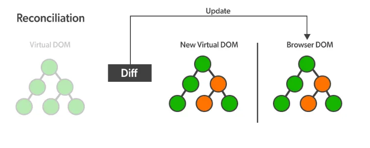

<aside>
💡 리액트는 가상돔(Virtual DOM)을 사용해 보다 효율적으로 우리가 원하는 페이지를 브라우저에 빠르게 그려준다

</aside>

## DOM (Document Object Model)

- `HTML문서`를 `구조화`하여 나타낸 것
- 브라우저가 화면을 그리기 위해서 필요한 정보가 `트리 형태`로 저장된 데이터
- 웹 페이지의 객체 지향 표현
- `프로그래밍 언어`가 DOM구조에 `접근`할 수 있는 방법을 제공하여 문서 구조, 타일, 내용 등의 변경을 돕는 `인터페이스 역할`

## Virtual DOM (가상 돔)

실제 DOM과 같은 내용을 담고 있는 `복사본` ( `JS 객체 형태`로 `메모리`안에 `저장` )

브라우저에 있는 문서에 직접적으로 접근할 수 없고 내용을 직접 수정할 수 도 없음

`변화 한 부분`만 브라우저에게 알려 `실제 DOM에 적용`

```jsx
// 전
<div>
	<h1>제목</h1>
</div>

// 후
<div>
	<h1>제목</h1>
	<p>내용</p>
</div>
```

⇒ p태그가 추가되었다면 브라우저에게 \<div>, \<h1>, \<p>를 모두 전달하는 것이 아니라 \<p>의 변화를 알려 \<p>만 DOM에 추가

## 왜 Virtual DOM을 사용할까?

사실 DOM은 트리구조이기 때문에 알고리즘을 사용하면 DOM안의 정보를 조작하는 건 그다지 무거운 작업이 아님

그러나 매번 DOM을 조작할때마다 `브라우저 화면의 UI를 새롭게 그려주는 작업`(리플로우, 리페인트)은 오래 걸리고 이는 `성능에 악영향`을 줌

이에 가상돔을 사용하여 변화된 부분만 DOM에 업데이트 시켜 그려줌

**⇒ 사용자가 느끼기에 빠르고 사용 경험이 좋음**

## 재조정 (Reconciliation)

리엑트는 항상 `두개의 가상돔` 객체를 가지고 있음

1. `렌더링 이전` 화면 구조를 나타내는 가상돔
2. `렌더링 이후`에 보이게 될 화면 구조를 나타내는 가상돔



1. `리렌더링`이 `발생`할 때마다 새로운 내용이 담긴 `가상돔`을 `생성` ( 실제 브라우저에 그려지기 이전 )
2. `렌더링 이전` 내용을 담고있는 첫번째 `가상돔과` `업데이트 이후`의 두번째 `가상돔`을 `비교`
   - 정확히 어떤 Element가 변했는지를 비교
   - 이 과정을 `Diffing`라고 함
3. `Diffing`을 통해 변경된 부분들을 파악한 이후, `Batch Update`를 수행함으로 `실제 DOM`에 `한번에` 적용

**⇒ 해당 과정을 통틀어 재조정이라고 함**

**Batch Update**

컴포넌트가 여러 번 업데이트 되더라도 실제 DOM 요소에 접근하는 것을 최소화하여 성능을 최적화 하는 기능

`변경된` 모든 `Element들을` `집단화` 시켜 이를 `한번에` `DOM에 적용`

Ex) 리스트안에 10개의 항목이 바뀌었다면 실제 DOM을 10번 반복해 수정하는 것이 아닌, 한 번에 집단화시켜 이를 적용

[Virtual DOM (React) 핵심정리](https://callmedevmomo.medium.com/virtual-dom-react-핵심정리-bfbfcecc4fbb)

[[React] 리액트의 작동 원리 (React-DOM 과 Virtual-DOM)](https://choyeon-dev.tistory.com/entry/React-리액트의-작동-원리와-최적화-virtual-DOM-optimization)
