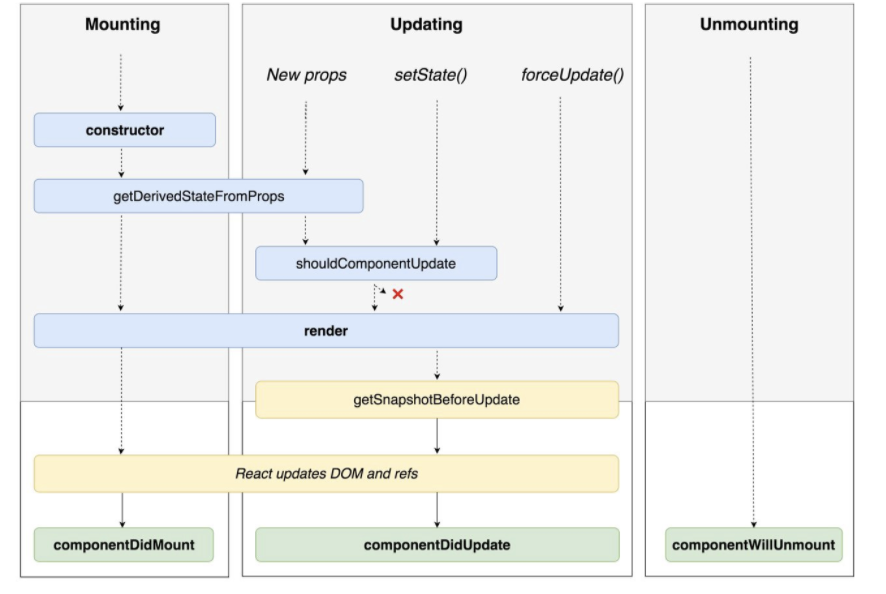

# 클래스형 컴포넌트와 함수형 컴포넌트의 차이를 설명해주세요.

> `React`에서는 컴포넌트를 `Class`과 `Function`으로 만들 수 있다.

## 1. 선언 방식

> Class Component

```jsx
// app_class.jsx

import React, { **Component** } from "react";

class AppClass extends **Component** {
  render() {
    return <div>Class</div>;
  }
}

export default AppClass;
```

-   `React`에서 제공하는 `Component`라는 클래스를 extends해서 만들 수 있다.

> Function Component

```jsx
// app_func.jsx

import React from "react";

const AppFunc = () => <h1>Function</h1>;

export default AppFunc;
```

## 2. State 사용 방식

> Class Component

```jsx
import React, { Component } from "react";

class AppClass extends Component {
  **state = {
    count: 0,
  };

  onIncrese = () => {
    const newCount = this.state.count + 1;
    this.setState({ count: newCount });
  };**

  **onDecrese = () => {
    const newCount = this.state.count - 1;
    this.setState({ count: newCount });
  };**

  render() {
    return (
      <>
        <h1>Class</h1>
        <div>{this.state.count}</div>
        <button onClick={this.onIncrese}>+1</button>
        <button onClick={this.onDecrese}>-1</button>
      </>
    );
  }
}

export default AppClass;
```

> Function Component

```jsx
import React, { useState } from "react";

const AppFunc = () => {
  **const [count, setCount] = useState(0);**

  **const onIncrese = () => {
    const newCount = count + 1;
    setCount(newCount);
  };**

  **const onDecrese = () => {
    const newCount = count - 1;
    setCount(newCount);
  };**
  return (
    <>
      <h1>Function</h1>
      <div>{count}</div>
      <button onClick={onIncrese}>+1</button>
      <button onClick={onDecrese}>-1</button>
    </>
  );
};

export default AppFunc;
```

## 3. Props 전달 방식

> Class Component

```jsx
...

  render() {
    return (
      <>
        <h1>Class</h1>
        <div>{this.state.count}</div>
        <button onClick={this.onIncrese}>+1</button>
        <button onClick={this.onDecrese}>-1</button>
        **<div>{this.props.hello}</div>**
      </>
    );
  }
}

export default AppClass;
```

> Function Component

```jsx
import React, { useState } from "react";

const AppFunc = (**props**) => {
...

  return (
    <>
      <h1>Function</h1>
      <div>{count}</div>
      <button onClick={onIncrese}>+1</button>
      <button onClick={onDecrese}>-1</button>
      <div>{**props.hello**}</div>
    </>
  );
};

export default AppFunc;
```

## 4. LifeCycle



> Class Component

class component 내부에서는 lifecycle method를 통해 로직을 처리할 수 있다.

```jsx
componentDidMount() {
    console.log("Component did Mount!!");
}

componentDidUpdate() {
    console.log("Component did Update!!");
}

componentWillUnmount() {
    console.log("Component will unMount!!");
}
```

> Function Component

useEffect 라는 Hook을 이용하면 생명주기 메소드를 사용할 수 있다.

```jsx
// 1. component가 mount 되었을때
useEffect(() => {
    console.log("마운트 될때만 실행!");
}, []);

// 2. component가 업데이트 되었을때
useEffect(() => {
    console.log("count의 값이 변할 때만 실행!!!");
}, [count]);
```

### 참조

[[React] - Class 컴포넌트 vs Function 컴포넌트](https://velog.io/@cychann/React-Class-컴포넌트-vs-Function-컴포넌트)
