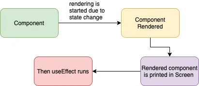
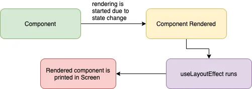
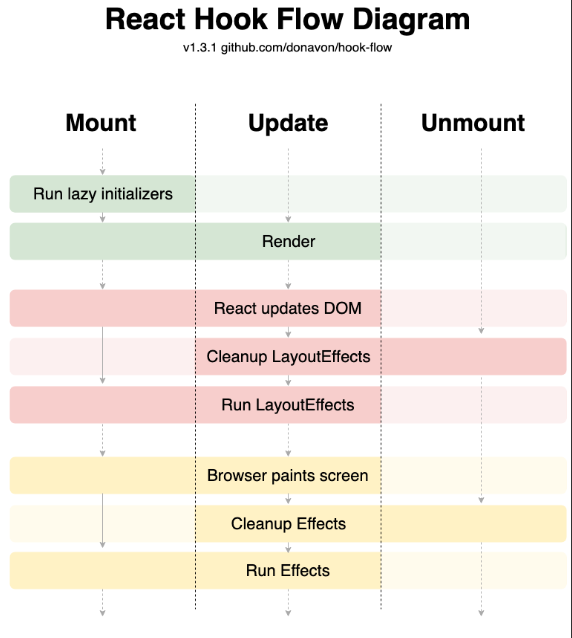

b> 필수 개념 2가지

- **Render**
  **DOM Tree를 구성하기 위해 각 엘리먼트의 스타일 속성을 계산하는 과정**
- **Paint**
  **실제 스크린에 Layout을 표시하고 업데이트하는 과정**

### React에서 Side Effect란

- **함수가 실행되면서 함수 외부에 존재하는 값이나 상태를 변경시키는 등의 행위**
- **함수의 `순수성`을 해치는 것들을 의미**

**종류**

- Data Fetching
- DOM 접근 및 조작
- 구독 ( Subscribe ) - EX) setTimeout, setInterval 등
- 쿠키

- **순수 함수**
  1. 동일 입력에는 항상 같은 값을 반환해야 함
  2. 반환되는 값은 외부 데이터의 개입 없이 입력에만 의존해야 함
  3. 함수 실행으로 인한 side effect가 없어야 함(외부의 상태를 변경하지 않는다)
- **멱등성**

  연산을 여러 번 적용하더라도 결과가 달라지지 않는 성질

- **Side Effect를 처리 하기 위한 조건**
  1. 렌더링을 Blocking 하지 않기 위해서 **렌더링이 모두 완료된 후에 Side Effect가 실행될 수 있어야 한다.**
  2. 매 렌더링마다 Side Effect가 실행되는 것이 아니라 **필요할 때만 Side Effect가 조건부로 실행되도록 해주어야 한다.**

<aside>
💡 이런 Side Effect를 처리하기 위해 리엑트에서는 useEffect, useLayoutEffect 훅을 제공

</aside>

</br>

```jsx
useEffect(() => {
  // do side effects
  return () => /* cleanup */
}, [dependancy array]);

useLayoutEffect(() => {
  // do side effects
  return () => /* cleanup */
}, [dependancy array]);
```

</br>

### useEffect

- `render`와 `paint`된 `후` 실행
- `비동기적`으로 실행
- useEffect 내부에 dom을 조작하는 코드가 있을 경우 `화면 깜빡임` 발생



</br>

### useLayoutEffect

- `render`된 `후` 실행, 그 이후에 `paint`
- `동기적`으로 실행
- paint가 되기전에 실행되므로 dom을 조작하는 코드가 있더라도 `깜빡임 x`



</br>

### 브라우저에 변경이 생긴 경우

1. 브라우저의 사이즈가 변경된다.
2. 브라우저는 변경된 `레이아웃을 계산`
3. `useLayoutEffect` 훅이 실행
4. 브라우저가 변경된 레이아웃을 기반으로 뷰를 업데이터하고 `렌더링`
5. `useEffect` 훅이 실행



</br>

### **결론**

1. **두 훅의 차이점은 브라우저 페인팅 전후에 따른 실행 순서의 차이**
2. **useLayoutEffect는 로직이 복잡할 경우 레이아웃을 보는데 까지 시간이 오래걸린다는 단점이 있음**
3. **기본적으로 useEffect를 사용하되 동기적인 렌더링, 깜빡임 등에 useLayoutEffect를 제한적으로 고려**

크롬 브라우저에서는 useLayoutEffect를 사용할 때 DevTools에서는 layout과 paint 성능을 측정할 수 있는데 이러한 성능 모니터링 기능을 사용할 때는 useLayoutEffect를 사용하면 유용함

SSR에서 useLayoutEffect 사용 시 오류가 난다고 함

[https://velog.io/@khy226/SSR에서는-UseLayoutEffect-대신-useEffect를-사용하자](https://velog.io/@khy226/SSR%EC%97%90%EC%84%9C%EB%8A%94-UseLayoutEffect-%EB%8C%80%EC%8B%A0-useEffect%EB%A5%BC-%EC%82%AC%EC%9A%A9%ED%95%98%EC%9E%90)

[[React] useEffect 와 useLayoutEffect 의 차이는 무엇일까?](https://medium.com/@jnso5072/react-useeffect-와-uselayouteffect-의-차이는-무엇일까-e1a13adf1cd5)

[useEffect가 나를 열받게 했다](https://iborymagic.tistory.com/140)
